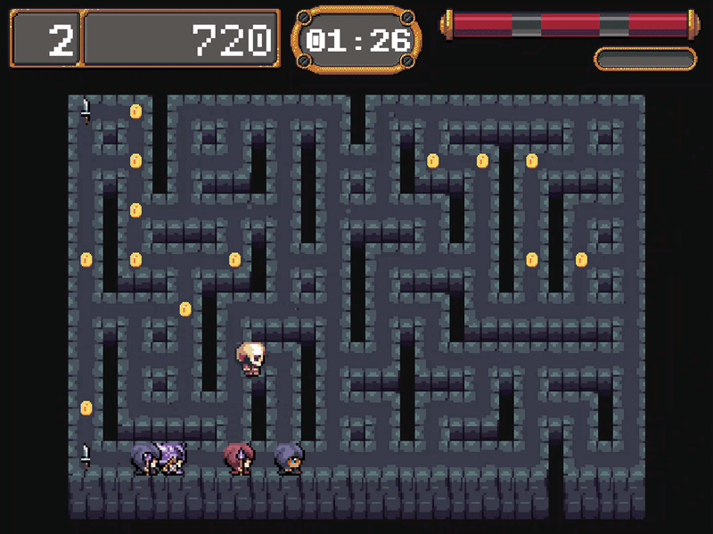
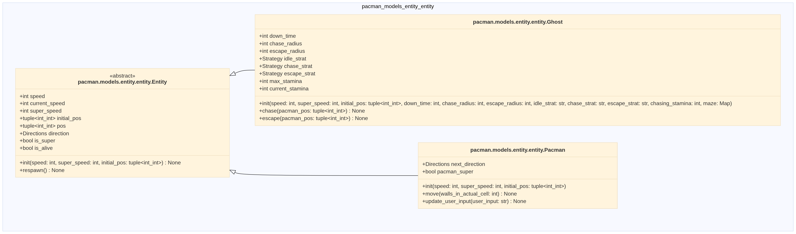
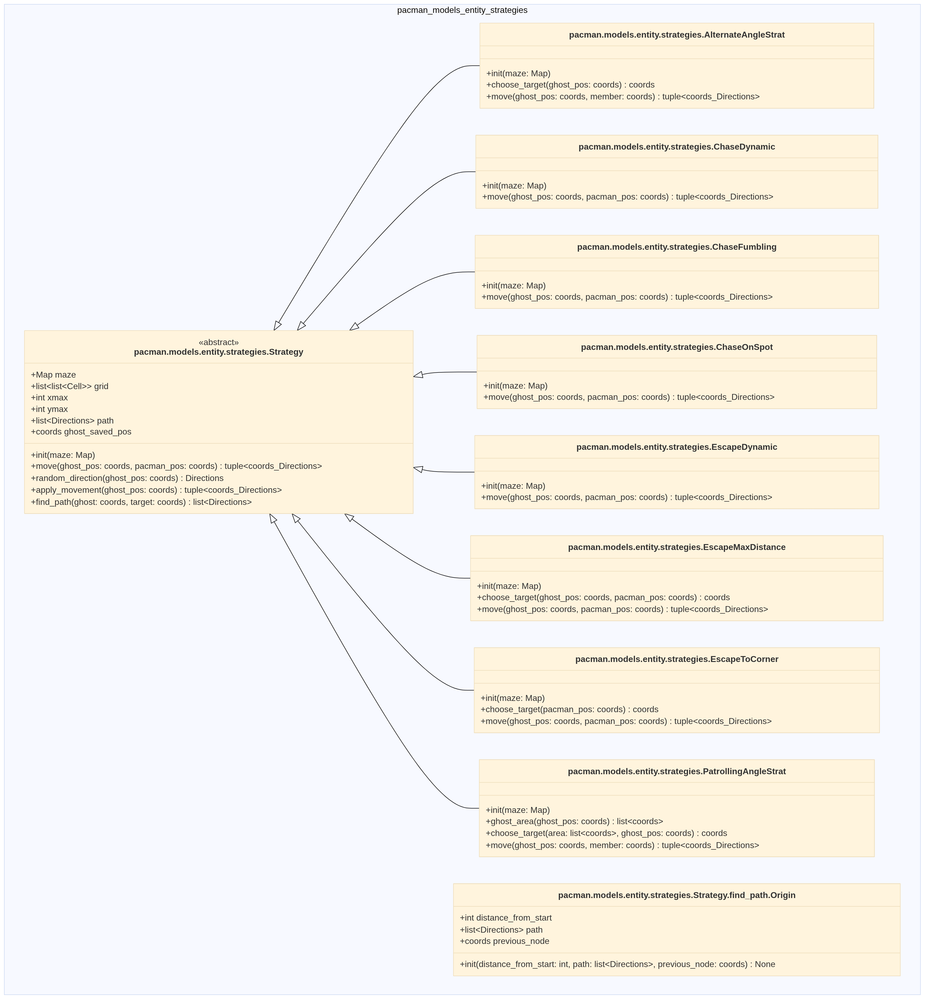
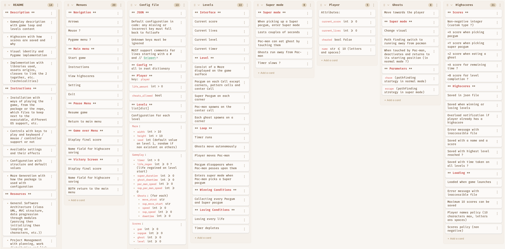

## Enter the crypt

*And put down the dead before they get the chance to rise from their tomb again.*



## Description

First released in 1980 by Namco, Pac-Man quickly became a cultural icon and one of the most influential video games of all time. Designed by Toru Iwatani, its goal was to create a game that could appeal to women and casual players, contrasting with the space shooters of the era. The game introduced the now-famous ghost AI, each with unique behavior.

Pac-Man was also the first game to popularize the concept of a power-up — the Pacgum (or Power Pellets) that lets you eat the ghosts. The original arcade machine had 256 levels, but due to an integer overflow bug, level 256 was impossible to finish, known as the infamous “kill screen”.

In this project, we had breathe new life into this classic by building our own version — in Python, with modern structure and project organization, ready to be deployed on a real gaming platform.

This project allowed us to greatly improve the following skills:
- 2D rendering
- Object-Oriented programming
- Configuration management
- Game architecture
- Interface design
- Object-Oriented conception
- Dependancy management
- Application packaging & deployment

## Features

### Customizable levels

### Languages and Keybinds support

### Cheats

### Highscore

## Instructions / Installation
To use this project, you can download its zip file from github, or by running this command in a terminal located in the chosen destination:

```bash
git clone https://github.com/jolyne-mangeot/Pac-man
```

And to run it, ensure python is installed on your computer or virtual environment, and run the following commands:

```bash
pip install -r requirements.txt
python pacman.py pacman/config.json
```

If you're unsure of these commands' action or want to run the program in a virtual environment without typing every command, see the instruction for the Makefile just below.

### Makefile

This project contains a Makefile, a file that is used to pre-enter commands to run to perform different tasks like installation, running and cleaning. The following rules are integrated here:

| Rules | Action |
|---|---|
| run | run the pacman file with arguments, ensuring everything is installed |
| skip-install | when dependencies are installed, run the pacman file without checking dependencies |
| debug | run the pacman file with arguments through pdb |
| install | create a virtual environment and install dependencies |
| clean | remove mypy cache, python cache, build files and output_file |
| fclean | run clean and remove the virtual environment |
| lint | run flake8 and mypy with flexible rules |
| lint-strict | run flake8 and mypy with strict rules |

To run any, enter 'make' followed by the selected rule in a terminal located at the project's root folder, like so:

```bash
make install
```

Executing `make` alone is an equivalent to `make run`.

### Configuration
The config file uses JSON. This JSON file handles comments. Lines starting with # or // are comments and are ignored.


## General sofware architecture
We used a MVC architecture which is a fundamental design pattern that helps us organize code by separating the project into three interconnected components : Model - View - Controller. These three distinct layers work together to create well-structured applications. 


### Controller
Description de ce qu'il y a dans controller

### Model
The “models” module contains all of the game's logic and state, independent of the display (View) and input handling/game loop (Controller). It is divided into several submodules:
- [Entity module](#Entity)
- [MazeMap module](#MazeMap)

### View
Description de ce qu'il y a dans view

## Maze-generator
Unfortunately, the scope of this project did not allow us to use the maze generator we had created for the `Amazing` project. We had to use a pre-built generator. It was provided as a `.whl` file. So we simply ran `pip install` in our virtual environment to make it available in our Python library, and then imported it into the `utils.py` file in our `pacman/models/mazemap/` module.

The generator creates a maze in the form of a y-by-x matrix containing, in binary, information about the maze's walls. 0 represents a cell with no wall, 1 represents a single wall to the north, 2 represents a single wall to the east, 4 represents a single wall to the south, and 8 represents a single wall to the west. Thus:

||||||||||||||||||
|-|-|-|-|-|-|-|-|-|-|-|-|-|-|-|-|-|
| Int | 0 | 1 | 2 | 3 | 4 | 5 | 6 | 7 | 8 | 9 | 10 | 11 | 12 | 13 | 14 | 15 |
| Binary | 0000 | 0001 | 0010 | 0011 | 0100 | 0101 | 0110 | 0111 | 1000 | 1001 | 1010 | 1011 | 1100 | 1101 | 1110 | 1111 |
| Walls | No wall | N | E | NE | S | SN | SE | SNE | O | ON | OE | OEN | OS | OSN | OSE | OSEN

The algorithms we used to solve our maze were designed for an x-by-y maze. To simplify the behavior algorithm for our entities, we therefore formatted the provided maze. The maze generated by the MazeGenerator is formatted in the `utils.py` file of the `pacman/models/mazemap` module using the maze_interface() function. After this formatting, we obtain an x-by-y grid of Cells, which is then stored in the Map class in the `map.py` file.

Our approach to managing wall information was also different: we used a list of four Booleans for each cell in the maze, with each index in the list corresponding to information about a wall. We felt that the binary approach was much more efficient, so we stuck with it. Each cell in the grid therefore contains a `walls` attribute, which is simply an integer between 0 and 15.

## Implementation

### Entity

#### Architecture




The module is divided into two files with distinct responsibilities:

- `entity.py`: defines what the entities are (Entity, Pacman, Ghost)—their state (position, velocity, direction, lives) and their specific attributes.
- `strategies.py`: defines how ghosts move, using the Strategy pattern. A Strategy is an independent class that calculates a ghost's next position based on its current position and that of a target; Ghost simply delegates the call to one of its three strategies (idle_strat, chase_strat, escape_strat) depending on the game context.

The concrete strategies are divided into three families, each of which inherits from the abstract Strategy class:

|Type|Role|Implementations|
|---|---|---|
|Chase|Chase Pac-Man|ChaseStrumbling, ChaseDynamic, ChaseOnSpot|
|Idle|Patrolling without a pursuit|AlternateAngleStrat, PatrollingAngleStrat|
|Escape|Escape Pacman|EscapeMaxDistance, EscapeToCorner, EscapeDynamic|

All strategies also inherit from `Strategy.find_path()`, which implements the A* algorithm to calculate the shortest path from the ghost to the target.

#### Design Choices
- Pattern Strategy rather than conditional branches in Ghost. Each movement behavior is isolated in its own class, which allows us to add, replace, or combine behaviors without modifying Ghost or the other strategies
- String-based configuration (strat_dict): Ghost receives the names of the strategies (idle_strat: str, chase_strat: str, escape_strat: str) rather than instances, and resolves them via strat_dict. This allows us to define the behavior of each ghost from an external configuration file.
- Reusing the intersection graph for A* algorithm. Rather than running an A* search on all cells, each strategy relies on the intersection graph already constructed by `Map.generate_cell_graph()`, which makes pathfinding significantly less computationally expensive.
- Stamina mechanics. `chase()` artificially limits the duration during which a ghost can continuously chase Pac-Man (`current_stamina`), which regenerates during idle/escape phases.This design prevents a ghost from chasing indefinitely and makes the game more playable.
- Various escape, chase, or idle methods. These allow us to give our ghosts a variety of behaviors and thus adjust the difficulty of the levels by using more or less aggressive strategies.
- `next_direction` (distinct from `direction` in Pac-Man). Allows the player to anticipate a turn before reaching the intersection that allows it, rather than requiring the player to enter at exactly the right moment.

### MazeMap

#### Architecture
The module is divided into two files:

- utils.py: low-level data types (Directions, Movements, Cell, Node) and the maze_interface() function, which acts as an adapter between the external maze generator and the game's internal model.
- map.py: the Map class, which manages the maze's storage, handles the gums, and constructs the intersection graph used for the ghosts' pathfinding.

#### Design Choices
- Representation of walls using a bitmask rather than a list of Booleans. Each Cell stores an integer `walls` (0 to 15) instead of a list of four Booleans. This choice (already explained earlier in the README) allows wall checks to be performed using a simple binary operation
(walls & direction.value) instead of indexed access, and aligns directly with the format returned by the external generator.
- `maze_interface()` as an adaptation layer. The external generator indexes its grid in (y, x). maze_interface() performs the conversion to the (x, y) indexing used by the rest of the game and constructs a Cell object for each cell. Isolating this conversion into a single function prevents the indexing logic from being scattered throughout the rest of the code, and
limits the impact of a generator change to just `utils.py`.
- Intersection graph rather than a full grid for A* algorithm. `record_maze_intersections()` identifies cells with 3 or 4 open walls, and `generate_cell_graph ()` constructs, for each one, a list of its directly accessible neighboring intersections, via `find_intersect()`, which
follows a corridor cell by cell until it reaches the next intersection. This reduces the pathfinding search space to only the actual decision points in the maze.
- Tracking the gums using a Boolean in Cell and a set in Map. Each cell stores a Boolean (simple_gum/super_gum) for display and local testing, while Map maintains, in
parallel, the sets simple_gums/super_gums of coordinates, allowing direct access to the positions of the remaining gums without having to scan the entire grid.
- Turn dictionaries (RIGHT_TURN, LEFT_TURN, OPPOSITE_DIRECTION). Rather than recalculating these relationships on the fly, they are precalculated as module constants, used by
both `find_intersect()` and `Strategy.find_path()`.

### Pygame general implementation

#### Architecture
Pygame being the game's "engine", it had to be implemented in most of our modules and architecture choices. The library is imported in all controllers, many models and all views modules, used to receive the player's output as well as display everything on a graphical interface.

For inputs and menu management, State classes were created in the controllers/states module to divide our program into standalone pages, such as the main menu, the options menu and the game itself. Managed by the [Control class](pacman/controllers/statecontrol.py) and depending on the user's inputs, these states are activated and deactivated, enabling an easier memory management and how the game progresses.

And for displaying, the views/menu module helps rendering option menues described in this [documentation file](docs/Menu-Options.md), while the Display subclasses, each dedicated to their own state, also have the unique responsibility of rendering assets and variables.

#### Design Choices

Pygame was the main reason we opted for a MVC pattern. With numerous modules, the library can quickly create inter-dependencies and extremely long methods and classes. That's why we thought first-hand on how to keep this project manageable, and clear to approach.

- If navigating multiple folders and cutting up modules between three different folders can seem confusing at first, when the project kept growing, it helped us staying focused on separating the modules' responsibilities. For the menues, the parsing of events is placed in a controllers class, the options themselves are models, and the renderer dedicated to them is in views.
- A Control class centralizing all informations and being referenced in almost the entire project was the key to keeping the user's configuration and the displaying aligned together.
- The same way, a common Display class, parent of all state displaying class, helped centralizing the file accesses for sprites and reducing endless lines of scaling.

## Project management



## Resources

> [!NOTE]
> No AI was used in the making of this project.

### Parsing
JSON parsing with comment:
- [Code snippet (StackOverflow)](https://stackoverflow.com/questions/29959191/how-to-parse-json-file-with-c-style-comments#:~:text=This%20implementation%20slightly%20improves%20the%20previous%20answer%20by%20replacing%20the%20comment%20line%20by%20an%20empty%20line%20rather%20than%20removing%20it%20completely%20because%20this%20breaks%20the%20line%20count)

Pydantic's documentation:
- [Models](https://pydantic.dev/docs/validation/dev/concepts/models/)
- [Field](https://pydantic.dev/docs/validation/latest/concepts/fields/)
- [Validators](https://pydantic.dev/docs/validation/latest/concepts/validators/)
- [Creating dynamic Fields](https://pydantic.dev/docs/validation/dev/examples/dynamic_models/)

### Menu and options
- [Pygame's keys list](https://www.pygame.org/docs/ref/key.html#:~:text=pygame%20Constant%20ASCII%20Description)
- [TEXTINPUT event type](https://www.pygame.org/docs/ref/event.html#:~:text=When%20compiled%20with%20SDL2%2C%20pygame%20has%20these%20additional%20events%20and%20their%20attributes)

### Architecture
- [MVC Structure](https://www.geeksforgeeks.org/system-design/mvc-design-pattern/)
